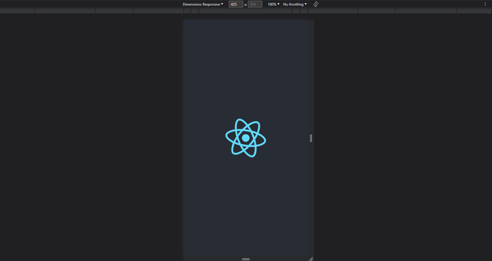
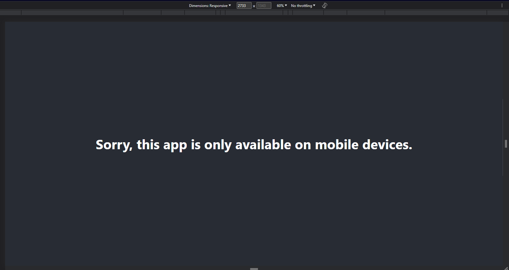

# Sample React App

This is a simple React application that demonstrates the usage of conditional rendering based on the window width.

## Installation

To run this application locally, follow these steps:

1. Clone the repository:

2. Navigate to the project folder:

3. Install the dependencies:

4. Start the development server:

5. Open your browser and visit [http://localhost:3000](http://localhost:3000) to see the app in action.

## Usage

The application will display a different layout depending on the window width. If the window width is less than or equal to 425 pixels, it will display the React logo, Otherwise, it will display a message stating that the app is only available on mobile devices.

## Demo link [https://sample-react-app-self.vercel.app/]

Feel free to explore the code and modify it according to your needs!

## Demo 1 (on mobile devices)

## Demo 2 (On other devices)

